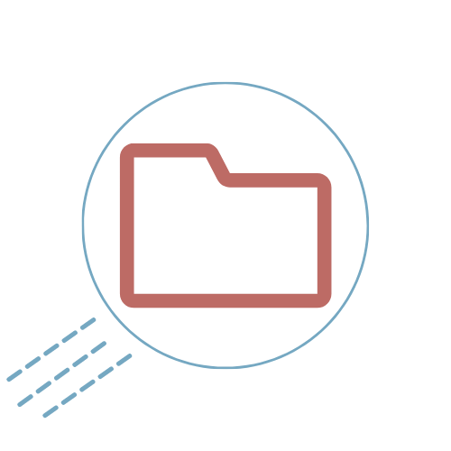

  

  <h2 align="center">Filing Saucer // Server</h2>
 
<i>"like a flying saucer, but for files... like in the cloud..."</i>

<h5 align="center">A file sharing server, intended to be the successor to A-Share! Users may use an API via POST and GET requests to exchange files. </h5>

  

    
    
    
     
     
    
    

    <a href="https://github.com/Aerial-Laptop/.github/blob/main/al-docs/NODEJS-SETUP.md">General Setup Documentation for NodeJS</a> from Aerial Laptop

